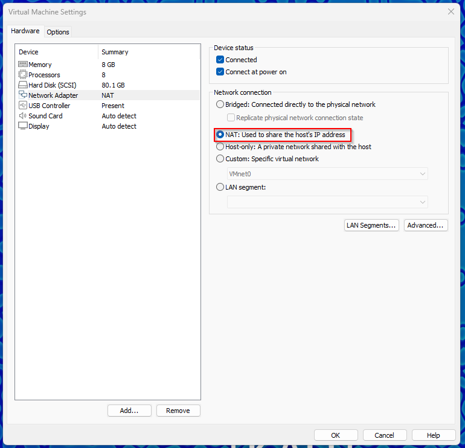

# Active Directory

# Description

This project goes over the process of attacking an Active Directory environment. Remediation process for each attack are suggested as well.

# Utilities Used

responder

hashcat

impacket

evil-winrm

# Environments Used

VMWare Workstation

Microsoft Windows Server 2022 Standard

x2 Microsoft Windows 10 Enterprise

Kali Linux with [PimpMyKali](https://github.com/Dewalt-arch/pimpmykali)

# Project Walkthrough

## Setup

You must have an Active Directory Domain Controller and Windows 10 workstations set up in a particular way for these attacks to work properly. You can either follow [this](https://www.youtube.com/watch?v=xftEuVQ7kY0) YouTube video for instructions, or go through [TCM Academy’s Practical Ethical Hacking](https://academy.tcm-sec.com/) course for proper instructions to get set up.

I also installed a Kali Linux machine that the attacks will be coming from. To ensure that you have everything communicating, make sure to change the NIC to NAT for all devices in the lab.



You need to go into the settings of your virtual machine to change this.

I also installed PimpMyKali onto the Kali box to add some extra features that will be used.

The tools you will need present on your Kali box are:

- responder
- hashcat
- impacket
- evil-winrm

# Attacks

## NR Spoofing Leading to SMB Credential Access

This is the most basic attack that can be performed with responder out of box. Essentially, all you need to do is run responder and wait for someone to attempt to connect to a non-existent SMB share.

You are essentially exploiting the broadcast performed between NBT-NS (NetBIOS Name Service), LLMNR (Link-Local Multicast Name Resolution), and mDNS (multicast DNS) by spoofing responses to their queries, tricking the victim into trusting the malicious server.

Because we have control over the workstations, we can simulate this event ourselves. This attack will cause the NTLMv2 hashes to be dumped, which we can take and crack.

```markdown
responder -I eth0 -dP -v
```


This shows me running the command.

Once you run responder, you need to go over to your Windows 10 workstation and attempt to access a fake SMB share.


I just typed in \\fake into file explorer.

This should drop the NTLMv2 hash of the user who attempted the connection onto your Kali box with the listening responder tool.


This shows responder dropping the NTLMv2 hash of the fcastle user.

From here, you can put the hash into a text file and use hashcat to attempt to crack the password.

```markdown
hashcat -m 5600 hash.txt /usr/share/wordlists/rockyou.txt
```


This shows Hashcat cracking that user’s password

### Remediation/Mitigation

- Disable LLMNR
- Disable NBT-NS
- Enable SMB Signing
- Enforce Stronger Password Policies

### Sources

- [TCM Academy Practical Ethical Hacking course](https://academy.tcm-sec.com/)
- [CYNET - LLMNR & NBT-NS Poisoning and Credential Access using Responder](https://www.cynet.com/attack-techniques-hands-on/llmnr-nbt-ns-poisoning-and-credential-access-using-responder/)

## SMB Relay Using Impacket-ntlmrelayx And Responder

This attack can be performed utilizing both impacket-ntlmrelayx and responder in conjunction. It’s very similar to the NR spoofing attack, but allows us to relay the captured NTLM hash and authenticate as that user. This can allow us to dump SAM hashes or gain shell access.

For this attack to work, there needs to be multiple machines with SMB signing disabled. Make sure to include all of the machines in a target.txt file, or else the attack will not work [[1](https://github.com/fortra/impacket/issues/1010)]

You can test to see if SMB signing is enabled but not required by executing the following command:

```markdown
nmap --script=smb2-security-mode.nse -p445 <ip>
```

You can also specify a range of IPs and scan for multiple vulnerable workstations.

Once you have all of the vulnerable workstations in a text document, you need to first run responder:

```markdown
responder -I eth0 -dP -v
```

And then execute the following command:

```markdown
impacket-ntlmrelayx -tf targets.txt -smb2support
```

This will dump the NTLMv1 hashes of all users on the machine.


The hashes of the vulnerable machines being dumped

You should also be able to use ntlmrelayx to open smb shells on the machine. If you do the following command:

```markdown
impacket-ntlmrelayx -tf targets.txt -smb2support -i
```

And then netcat into the session spawned. You will be able to access the machine through SMB.


Theoretically, this can then be used to perform a PtH attack utilizing something like evil-winrm. However, for this to work with evil-winrm, you need to configure your Windows Remote Management settings.

The command would look something like this:

```markdown
evil-winrm -i <ip> -u 'administrator' -H <hash>
```

### Remediation/Mitigation

- Enable SMB Signing on all devices
- Utilize account tiering
- Local admin restriction

### Sources

- [What Is SMB Relay? How It Works & Examples](https://www.twingate.com/blog/glossary/smb%20relay)
- [SMB Relay Attacks and How to Prevent Them in Active Directory](https://tcm-sec.com/smb-relay-attacks-and-how-to-prevent-them/)

# Conclusion

Here I’ve shown just two very basic attacks that can be performed on an Active Directory environment. Later on, I will show some other attacks utilizing ldapdomaindump, ldapsearch, bloodhound, crackmapexec, netexec and more. There are a variety of attacks the AD is vulnerable to, here is just an intro.

I will also show an example of utilizing evil-winrm practically and how you can use this tool to your advantage when exploiting an environment.

For now, NR Spoofing and SMB Relay attacks are two very common attacks that are often discussed when exploring exploiting Active Directory. These are typically the first couple things one should try when testing an environment, as you can quickly get credentials this way.